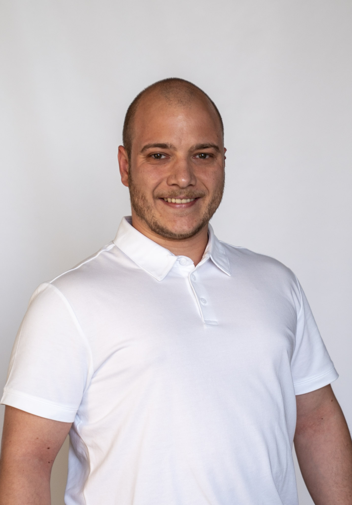

  <!-- Profile photo -->

    

  <!-- Name + Title -->

    <h1 style="margin: 0;">Cristian Chilba</h1>
    <h3 style="margin: 5px 0 0 0; font-weight: normal;">Senior Full-Stack Web Developer</h3>
    

      📍 Oradea, Romania  
      📞 +40 732 125 803  
      ✉️ <a href="mailto:chilba.cristi@gmail.com">chilba.cristi@gmail.com</a> 
      🔗 <a href="https://linkedin.com/in/cristian-chilba">LinkedIn</a> | 
         <a href="https://github.com/cristichilba">GitHub</a>
    

  

---

## 📝 Professional Summary
Experienced professional engineer specializing in the development of high-quality, full-stack solutions. Proven ability to deliver impactful results through effective collaboration and adaptability. Proficient in modern web technologies, backend systems, and agile methodologies. Recognized for reliability, flexibility, and a strong commitment to driving team success.

---

## 🏢 Work History

**Senior Full Stack Developer** – Mühlemann+popp AG *(Remote)*  
*September 2020 – Present*  

##### Tech Stack:
- PHP, Symfony, API Platform, Python  
- Vue.js, TypeScript, LESS, SASS, Tailwind CSS  
- Docker, Google Cloud  
- RabbitMQ, Redis, ElasticSearch  
- REST, GraphQL  

##### Responsibilities:
- Analyzed, refactored, and modernized 3 legacy applications  
- Worked closely with Swiss clients to build and maintain enterprise-grade applications and APIs  
- Integrated code quality tools and best practices into development workflows  
- Participated in the migration of monolithic applications to split-stack architectures  
- Developed and maintained systems using microservices architecture  

---

**Freelance Tech Lead** – Upwork.com *(Remote)*  
*August 2018 – September 2020*  

##### Tech Stack:
- PHP, Symfony, WordPress  
- AWS, DreamHost  

##### Responsibilities:
- Led web/API development and project management for a China-based, US-owned company providing cellular IoT solutions  
- Handled cloud infrastructure, sysadmin tasks, and website maintenance  
- Engineered enterprise-class applications and API solutions to support complex business needs  
- Led the development of custom automation bots to streamline and optimize high-demand product purchases at launch  

---

**Web Developer** – Apidemia *(Oradea)*  
*July 2016 – June 2018*  
- Developed PHP and Symfony applications  
- Built API solutions and contributed to frontend features  
- Gained experience with scalable web architectures  

---

## 🎓 Education

**Master of Science – IT Management**  
*University of Oradea, Romania – 2020*  
- Dissertation: *Integration and Performance Analysis of Multiple Databases in Symfony with Doctrine*  
- Focused on multi-database architecture and performance benchmarking in PHP applications  

**Bachelor of Science – Computers and IT**  
*University of Oradea, Romania – 2018*  
- Diploma Project: *Web application for calorie and macronutrients management* using DotKernel 3  

---

## 💻 Skills

- Backend development  
- Frontend development  
- API integration  
- Technical analysis  
- Microservices architecture  
- Machine learning integration  
- Automated testing  
- Requirements analysis  

---

## 🌐 Languages
- **Romanian**: Native  
- **English**: Fluent  
- **French**: Intermediate  
- **Italian**: Elementary (currently studying with Duolingo)  

---

## 🎤 Conferences
- Presented *“Web Application for Calories and Macronutrients Management”* at the Annual Scientific Conference of Students (2018)  

---

## 📝 Publications
- Published [Comparison of DotKernel and Symfony as PHP frameworks](https://ieeexplore.ieee.org/abstract/document/9223157) at the 2020 12th International Conference on Electronics, Computers and Artificial Intelligence (ECAI)

---

## 📚 Courses
- Public speaking, time management, leadership – organized by certified trainers of the Romanian Students Union  
- Career management conferences, generic and specific counseling sessions – part of the project *“Today's Students, Tomorrow's Professionals”* in Oradea  
